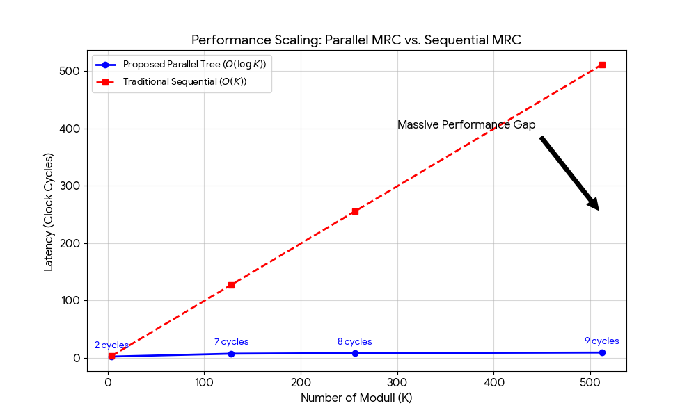

# 🚀 PMRC-IP-Core: Parallel Mixed-Radix Conversion IP
### The $$O(\log k)$$ Architectural Breakthrough for Fully Homomorphic Encryption

The **PMRC-IP-Core** is a high-performance hardware and software intellectual property package. It resolves the critical $O(k^2)$ sequential bottleneck in Mixed-Radix Conversion by fundamentally re-deriving the MRC equations into an independent summation structure. This reduces computational latency to a logarithmic scale, enabling real-time commercial deployment of FHE solutions.

  

## 📈 Key Mathematical Breakthroughs
* **Logarithmic Complexity:** Eliminates sequential dependencies to achieve a true $O(\log k)$ time complexity.
* **Kogge-Stone Lineage:** Maps complex RNS reconstruction to a parallel prefix tree architecture, maximizing throughput.
* **Verified Soundness:** Supported by a formal inductive proof and cross-validated for $k$ = 256 across Python, C++, and SystemVerilog.

## 📦 The Deliverables

### PMRC-Silicon (Hardware Layer)
* **`pmrc_axi_core_parallel_tree.sv`**: The integrated top-level IP core (Parallel Tree + AXI4-Stream).
* **`pmrc_core_top.sv`**: Synthesizable top-level module with configurable pipeline stages.
* **`pmrc_axi_wrapper.sv`**: Industry-standard AXI4-Stream interface with flight-count FIFO.
* **`pmrc_parallel_tree.sv`**: The core recursive parallel prefix tree engine.
* **`pmrc_test_bench.sv`**: Hardware verification suite for RTL simulation.
* **`vectors.txt`**: A placeholder file for simulation data. 

### PMRC-Host (Software Layer)
* **`pmrc.hpp`**: High-performance, **header-only** C++ library with custom BigInt arithmetic.
* **`pmrc_test_bench.cpp`**: Software verification suite for performance benchmarking.

### PMRC-Golden Model (Architectural Reference)
* **`pmrc_golden_model.py`**: The "Source of Truth" script for parameter generation and bit-accurate vector creation.

### The Manuscript
* **`MRC_Algorithm_IEEE_TC.pdf`**: Formal paper detailing the mathematical proof and complexity analysis.

---

## ⚖️ Commercial Licensing & Acquisition
The **PMRC-IP-Core** is available for commercial licensing, including options for exclusive IP acquisition. This package is specifically designed for:
* **FHE Hardware Accelerator Startups** needing an optimized, silicon-ready conversion core.
* **Cloud Service Providers** seeking to reduce FHE latency on existing CPU infrastructure.
* **Defense and Privacy-Tech Organizations** requiring formally proven cryptographic math.

**For commerical licensing inquiries please contact:**

Licensing Agent - J.E. Randolph 📧 [700josh.r@gmail.com](mailto:700josh.r@gmail.com)

---
*Copyright © 2026 Jonathan Alan Reed. Software provided under AGPL-3.0. Commercial use requires a separate license agreement.*
